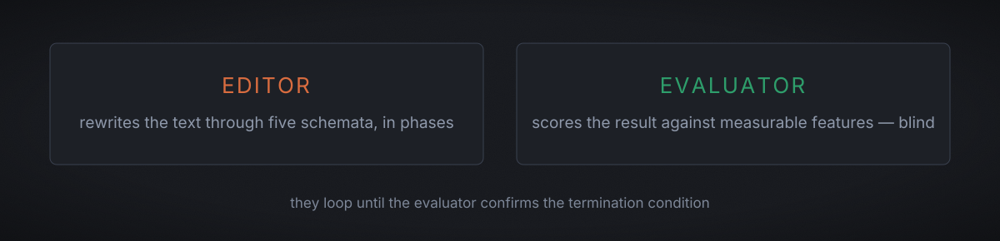
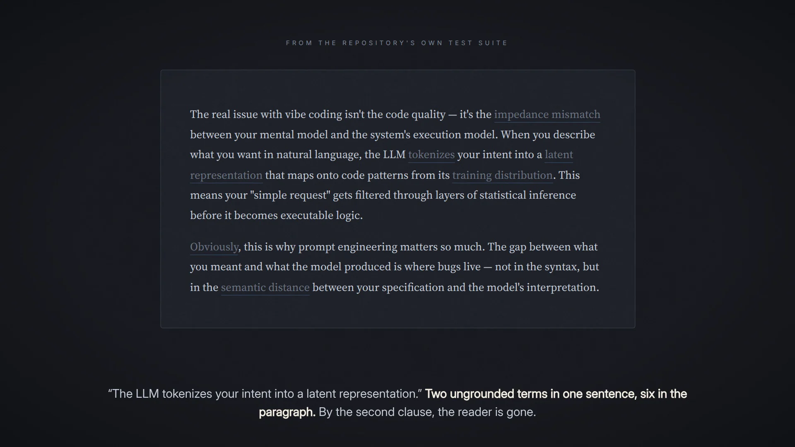
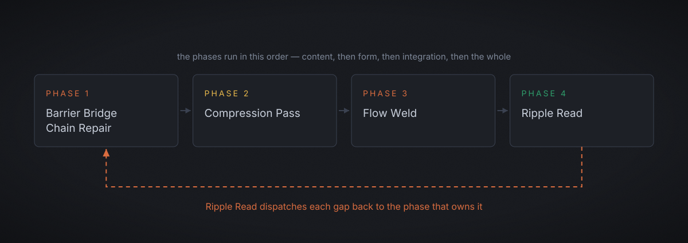
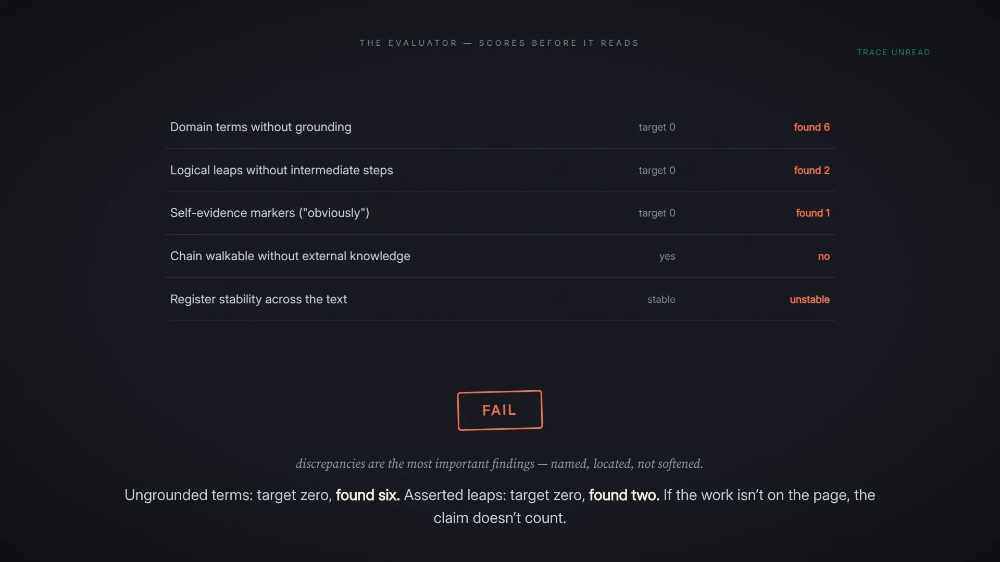
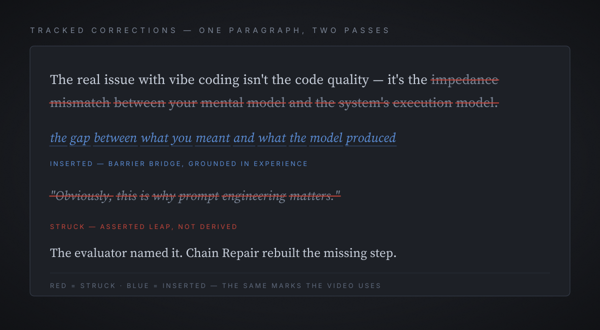
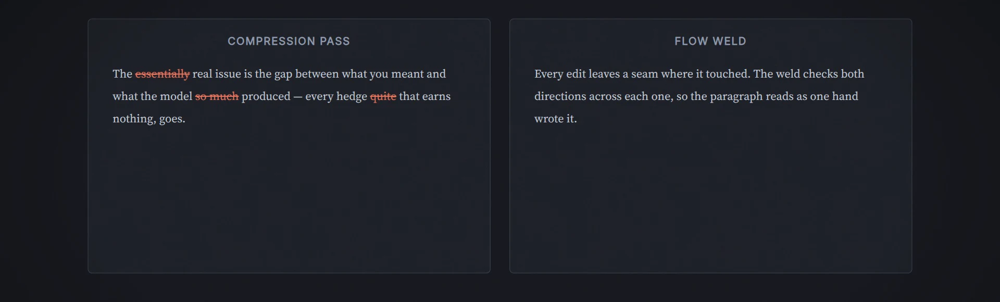
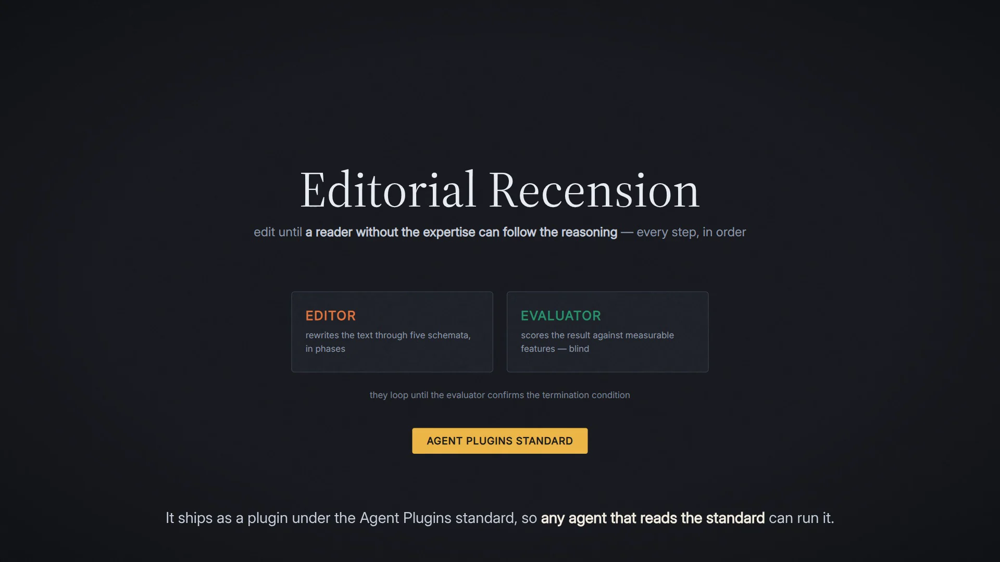
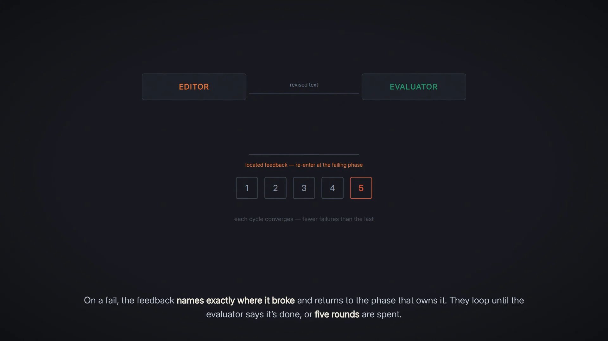
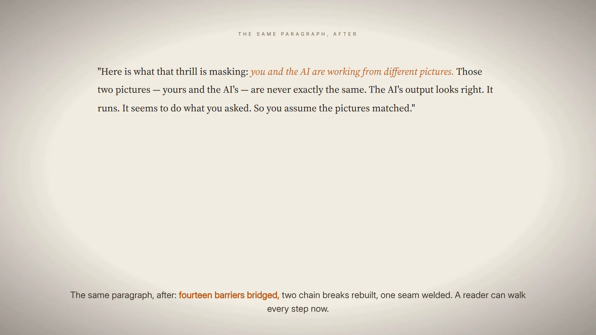
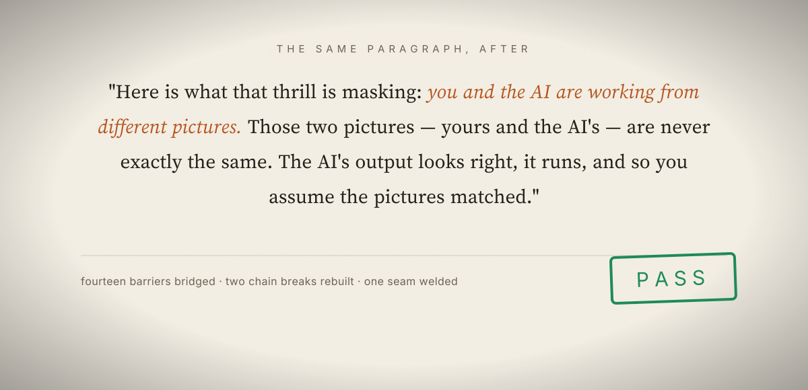

# Editorial Recension _(Editorial-Recension)_

[](https://github.com/RichardLitt/standard-readme)
[](./LICENSE)
[](https://github.com/agentplugins/agent-plugins-spec)
[](https://github.com/AlastairZeved/Editorial-Recension/releases/tag/v6-showcase)

A two-agent editing loop that rewrites prose until readers without the author's expertise can follow it.

<p align="center">
<video src="https://github.com/user-attachments/assets/5faf8217-02eb-473a-bcc3-64ab35563ca7" controls preload="metadata"></video>
</p>

<p align="center"><sub>2:21 — the two agents, the loop, and a full recension pass &nbsp;&middot;&nbsp; press play (GitHub starts the player muted — unmute for the narration)</sub></p>

---

<p> <sub>00 &middot; START HERE</sub></p>

## Start here

Editorial Recension is a two-agent editorial system packaged as a portable [Agent Plugins 1.0.0](https://github.com/agentplugins/agent-plugins-spec) package that runs on any conformant agent client. Its purpose is narrow and specific: edit prose until a reader who lacks the author's domain expertise can follow the reasoning chain — not until it "reads well" to someone who already understands it.



The system has two agents and a controller. The **editor** agent holds five named schemata — Barrier Bridge, Chain Repair, Compression Pass, Flow Weld, and Ripple Read — as its perceptual apparatus, and runs them in phases over your text. The **evaluator** agent scores the result against a measurable feature set *before* it reads the editor's explanation of what it did, then confirms or rejects the editor's claim that the editing is complete. They loop until the evaluator confirms all tests pass, or until five cycles are spent and output is finalized.


### The verdict legend

There are only three verdicts for each test:

| Verdict | Mark | What it means |
|---|---|---|
| **PASS** | &nbsp; green `#2e9e6b` | Every feature meets its target, no trace discrepancies, and the termination condition survives an independent clean read. Only the evaluator can say it. |
| **FAIL** | &nbsp; red `#c4453a` | One or more features are below target, or the editor's trace does not match what the text shows. Named, located, not softened; the loop continues. |
| **Needs Revision** | &nbsp; gold `#e8b84b` | The FAIL state as the editor receives it — located feedback, re-enter at the failing phase — and the best-effort output after five cycles, where the remaining failures are named and left open. |

<p><sub>Where you are, in one screen</sub></p>

| &nbsp; | Section | Why you'd read it |
|---|---|---|
|  | **[Install](#install)** | The package is portable; install the whole directory, not the skill folder. |
|  | **[Usage](#usage)** | The intake questionnaire is load-bearing: vague answers are rejected on purpose. |
|  | **[How It Works](#how-it-works)** | Four layers, and the cycle diagram of the loop itself. |
|  | **[The Five Schemata](#the-five-schemata)** | The five moves, which scale each fires at, and who owns which decision. |
|  | **[Test Evidence](#test-evidence)** | One paragraph, three planted defects, and the evaluator's actual scores. |
|  | **[How these docs are built](#how-these-docs-are-built)** | The palette, type, and textures — taken from the film, not invented. |

<p><sub>CONTENTS</sub></p>

## Table of Contents

- [Start here](#start-here)
- [Background](#background)
- [Install](#install)
  - [Dependencies](#dependencies)
  - [What ships in the package](#what-ships-in-the-package)
  - [Supported clients](#supported-clients)
  - [Any other agent](#any-other-agent)
- [Usage](#usage)
  - [The intake questionnaire](#the-intake-questionnaire)
  - [What you get back](#what-you-get-back)
  - [When not to use it](#when-not-to-use-it)
- [How It Works](#how-it-works)
- [The Five Schemata](#the-five-schemata)
- [Design Principles](#design-principles)
- [Test Evidence](#test-evidence)
- [API](#api)
- [The Showcase](#the-showcase)
- [How these docs are built](#how-these-docs-are-built)
- [Maintainers](#maintainers)
- [Thanks](#thanks)
- [Contributing](#contributing)
- [License](#license)

---


<p> <sub>01 &middot; BACKGROUND</sub></p>

## Background

Odinary single-pass editing optimizes for "reads well to someone who already understands it." A cleaner, tighter edit can leave every barrier intact — jargon: ungrounded claims with reasoning implied rather than explained, resulting in the user silently confused mid-text. That is the opposite of the job of writing for an audience. Concepts that use terms without defining them, definitions that require pre-existing knowledge to understand the over-arching concepts - written under the guise of "informative" or "explanatory" without disclosing 5-7 years of experience is required to understand the text.



<p align="center"><sub>the exhibit — 6 ungrounded terms, 1 asserted leap, FAIL &nbsp;&middot;&nbsp; from <a href="./tests/test-paragraph.md"><code>tests/test-paragraph.md</code></a></sub></p>

Editorial Recension is built to close that gap. Its architecture comes from four older disciplines, translated into editorial moves:

| Discipline | Translated into |
|---|---|
| **Forensic linguistics** | the evaluator is modeled on a questioned-document examiner: it checks a produced document against known standards instead of asking whether it feels good. |
| **Species counterpoint** | the five schemata are meant to be perceived simultaneously, the way a musician hears pitch, rhythm, and harmony at once, then executed in phases so the moves don't interfere with each other. |
| **Oral-formulaic composition** | the grounding requirement: every bridge is anchored in how a jump felt, what was confusing, or what made it click, not in a definition. |
| **Collaborative voice reconstruction** | the split of authority between the agent that rebuilds the text and the agent that verifies it. |

<p> <sub>02 &middot; INSTALL</sub></p>

## Install

Editorial Recension is a portable [Agent Plugins 1.0.0](https://github.com/agentplugins/agent-plugins-spec) package: a root `plugin.json` manifest (schema `https://agent-plugins.org/schemas/1.0.0/plugin.schema.json`) plus a top-level `skills/` directory. The repository is markdown and JSON — no build step — and installs on any conformant client.

> [!IMPORTANT]
> **Install the whole directory, not just the skill folder.** The skill references `agents/` and `schemata/` through relative paths (`../../` from the skill file), so those paths resolve only when the bundle is installed intact.

Clients without a native subagent mechanism can run the contents of `agents/editor.md` and `agents/evaluator.md` inline as prompts.

### Dependencies

| Requirement | Detail |
|---|---|
| Agent client | any [Agent Plugins 1.0.0](https://github.com/agentplugins/agent-plugins-spec)-compatible client — see [Supported clients](#supported-clients) |
| Runtime, package manager, build tooling | none. The package is markdown and JSON. |

### What ships in the package

| Component | Path | Role |
|---|---|---|
| Manifest | `plugin.json` | Agent Plugins 1.0.0 manifest — what clients validate and load |
| Skill | `skills/editorial-recension/SKILL.md` | The controller: intake questionnaire, dispatch, loop |
| Agents | `agents/editor.md`, `agents/evaluator.md` | The editor and evaluator the skill dispatches |
| Schemata | `schemata/*.md` (6 files) | The five editing schemata plus `scale-rules.md`, the coordination layer |
| Tests | `tests/` | Worked-case regression evidence; not loaded at runtime |
| Marketplaces | `.agents/plugins/marketplace.json`, `.github/plugin/marketplace.json` | Codex and Copilot CLI marketplace catalogs pointing at the package root |

### Supported clients

Install paths marked **verified** were exercised or checked against the client's current documentation (2026-09-12).

| Client | Route | Status |
|---|---|---|
| Hermes Agent | `hermes plugins install` | verified end to end (install → validate → remove) |
| Claude Code | `claude --plugin-dir` | verified against current vendor docs |
| OpenClaw | `openclaw plugins install git:…` | verified against current CLI docs |
| Codex | repo marketplace `.agents/plugins/marketplace.json` | verified against current Codex docs |
| Cursor | **Customize** → Install | verified against current vendor docs; no adapter file needed |
| GitHub Copilot | repo marketplace `.github/plugin/marketplace.json` | verified against current vendor docs |
| **Cline** | — | *not listed*: its plugin system takes TypeScript SDK modules, not Agent Plugins packages. Copy the repository into a `SKILL.md`-capable location instead (see [Any other agent](#any-other-agent)). |

**Hermes Agent** — *verified end to end (install → validate → remove):*

```sh
hermes plugins install AlastairZeved/Editorial-Recension --no-enable
hermes plugins enable editorial-recension
hermes gateway restart
```

Hermes scans community plugin sources at install time and may ask you to confirm before proceeding. `hermes plugins validate editorial-recension` checks the manifest without enabling anything.

**Claude Code** — *verified against current vendor docs:*

```sh
git clone https://github.com/AlastairZeved/Editorial-Recension.git
claude --plugin-dir ./Editorial-Recension
```

`--plugin-dir` loads the plugin for that session; see the [Claude Code plugins docs](https://code.claude.com/docs/en/plugins) for making it permanent. The repository ships no Claude Code marketplace file, so the `/plugin marketplace add` route does not apply.

**OpenClaw** — *verified against current CLI docs:*

```sh
openclaw plugins install git:github.com/AlastairZeved/Editorial-Recension
```

**Codex** — *verified against current Codex docs; the repository ships a repo marketplace (`.agents/plugins/marketplace.json`):*

```sh
codex plugin marketplace add AlastairZeved/Editorial-Recension
```

Then pick Editorial Recension from that marketplace in the Plugins Directory and install it. Codex loads this repository through its root Agent Plugins manifest — the documented package format.

> [!NOTE]
> The optional `.codex-plugin/plugin.json` overlay is deliberately not shipped: its OpenAI-specific settings are superseded by the root manifest's `extensions["com.openai"]` object, and a present root object replaces the overlay entirely.

Marketplace sources can be pinned (`codex plugin marketplace add AlastairZeved/Editorial-Recension --ref main`) or added from a local checkout (`codex plugin marketplace add ./Editorial-Recension`).

**Cursor** — *verified against current vendor docs; no adapter file needed:*

```sh
git clone https://github.com/AlastairZeved/Editorial-Recension.git
```

Open **Customize** in the Cursor sidebar, find Editorial Recension, and select **Install** (choose project or user scope). Cursor loads Agent Plugins standard packages — a root `plugin.json` plus `skills/` — without changes, so no Cursor-specific manifest ships here.

**GitHub Copilot** — *verified against current vendor docs; the repository ships a Copilot marketplace (`.github/plugin/marketplace.json`):*

```sh
copilot plugin marketplace add AlastairZeved/Editorial-Recension
copilot plugin install editorial-recension@editorial-recension
```

`copilot plugin install AlastairZeved/Editorial-Recension` also works: the install command accepts a GitHub repository root directly, without a marketplace.

### Any other agent

| Route | What to do |
|---|---|
| **SKILL.md-capable agents** | Copy the whole repository (or clone it) into the agent's skill/plugin discovery directory. Any agent that reads `SKILL.md` files picks up `skills/editorial-recension/SKILL.md`; the `../../` references resolve because the bundle is intact. |
| **Validation without installing** | `npx plugins.sh validate https://github.com/AlastairZeved/Editorial-Recension` checks the package against the Agent Plugins schema from any machine. The root manifest reports conformant; the `.claude-plugin/` client adapter reports schema warnings that are cosmetic (it follows Claude Code's manifest format, not the portable one). |

> [!TIP]
> This repository is not yet listed in the [plugins.sh directory](https://plugins.sh) — listing is a manual form submission reviewed by the registry's maintainer — so `npx plugins.sh install AlastairZeved/Editorial-Recension` will not resolve until that submission lands. Use the client routes above, or `hermes plugins install` / `openclaw plugins install`, which do not depend on the registry.

<p> <sub>03 &middot; USAGE</sub></p>

## Usage

There is no CLI binary to call. You use it inside a session with your agent, by asking for the thing the skill is built for:

```text
> Edit this paragraph so someone without my background can follow the reasoning.
```

The skill fires on requests to edit prose, essays, guides, documentation, or any writing meant to carry a reader through a reasoning chain — especially cross-domain writing, where the author has expertise the reader does not.

### The intake questionnaire

The skill does not start editing immediately. It asks three questions and validates the answers, because a vague target reader silently corrupts every downstream schema.

| # | Question | A valid answer | What always fails |
|---|---|---|---|
| 1 | **Target reader** — role or domain, what they already know, and what they don't | a role, at least one explicit *knows*, at least one explicit *doesn't know* | "non-technical", "general audience" — no role, no knows, no specific gaps |
| 2 | **Purpose** — a specific action the reader should be able to take after reading | a specific action verb attached to a specific object ("decide whether to sign", "ask informed questions about X") | "make it clear" — a property of the writing, not a reader outcome |
| 3 | **Source text** — a paste, a file path, a message reference, or a public URL | anything retrievable in this session | "what I wrote yesterday" — not retrievable |

The skill escalates on vagueness: one targeted clarification, then a direct checklist. It does not accept vagueness out of politeness. Valid answers are reformatted into a context block, which you confirm before any agent is dispatched:

```text
EDITORIAL CONTEXT — PLEASE CONFIRM

TARGET READER: Marketing manager at a fintech startup
KNOWS: Project management concepts, reading data dashboards
DOESN'T KNOW: ML background, how language models work internally

PURPOSE: Understand why AI-generated code is risky to trust
READER SHOULD: Explain the mechanism to their team

SOURCE TEXT: pasted paragraph, ~4 sentences
SOURCE TYPE: Direct paste
PRECEDING CONTEXT: None — Flow Weld operates at document boundaries only
```

If the text is part of a larger document, include the preceding paragraph when asked — the agents use it to check flow at the entry seam.

### What you get back

| Output | Contents |
|---|---|
| **Edited Text** | the final version |
| **What Changed** | which schemata fired, major rewrites, bridges added |
| **Editorial Trace** | condensed: schema, location, finding, action taken |
| **Evaluator Verdict** | PASS with a feature summary, or best-effort with remaining issues |

### When not to use it

- Code comments, commit messages, quick responses.
- Writing where the audience already shares the author's domain expertise and jargon is appropriate.
- First drafts that haven't been written yet — this is an editing loop, not a generation tool.

<p> <sub>04 &middot; HOW IT WORKS</sub></p>

## How It Works

The architecture has four layers. Each layer owns a decision the others may not make.

| Layer | Lives in | Owns |
|---|---|---|
| 1 — **Intake** | `skills/editorial-recension/SKILL.md` | validating the three questions and the audience definition every schema inherits |
| 2 — **Execution** | `agents/editor.md` + `schemata/` | rewriting the text through the phases |
| 3 — **Verification** | `agents/evaluator.md` | scoring the output against measurable features, independently |
| 4 — **Loop** | `skills/editorial-recension/SKILL.md` | routing feedback back and deciding when the loop is spent |

### The Editor ↔ Evaluator loop


<p align="center"><sub>on FAIL the output returns to the editor, which re-enters at the phase where the failures were found</sub></p>

**Layer 1 — Intake.** The skill validates the three questions, formats them into templates, and dispatches only after you confirm the context block. It escalates on vague answers: one targeted clarification, then a direct checklist — it does not accept vagueness out of politeness.

**Layer 2 — Execution.** The editor reads all six schemata files, then runs four phases: Barrier Bridge and Chain Repair together, then Compression Pass, then Flow Weld, then Ripple Read. If Ripple Read finds gaps, it dispatches them back to the responsible schema with specific, located feedback. The editor returns edited text, a schema trace of what fired where, and a termination assessment.

**Layer 3 — Verification.** The evaluator scores the output against every measurable feature *before* reading the editor's trace, then compares its independent scoring to the trace.

> [!IMPORTANT]
> Discrepancies are the most important findings: either the editor ran a schema without the work showing (execution failure), or skipped a schema and claimed it ran (compliance failure). The evaluator returns feature scores, discrepancies, and a PASS/FAIL verdict.

**Layer 4 — Loop.** On FAIL, the evaluator's located feedback goes back to the editor, which re-enters at the phase where the failures were found. On PASS, the termination condition is confirmed and the final output is presented.

| Limit | Behavior |
|---|---|
| Cycles | maximum **5 editor↔evaluator cycles** per session |
| Convergence | each cycle should converge — fewer failures than the last |
| Stall | if failures are not decreasing after cycle 3, the skill surfaces this and lets you decide |
| Cap | if not converged after 5 cycles, you get the best output so far with the remaining failures named |

<p> <sub>05 &middot; THE SCHEMATA</sub></p>

## The Five Schemata

Each schema file in `schemata/` has the same structure: Recognition Trigger, Execution Sequence, Scale, Completion Test, Measurable Features.

| Phase | Schema | What it does |
|---|---|---|
| 1 |  **Barrier Bridge** | Finds where the reader's knowledge ends and the author's assumptions begin; grounds terms and leaps in experience, not definitions. |
| 1 |  **Chain Repair** | Finds where reasoning is asserted rather than derived, and rebuilds the chain so each step is derivable from the last. |
| 2 |  **Compression Pass** | Removes words that don't earn their place — without stripping weight-bearing bridges. |
| 3 |  **Flow Weld** | Checks bidirectional flow at every edit point and removes the seams edits leave behind. |
| 4 |  **Ripple Read** | Reads the whole document across five ledgers (flow, coherence, rhythm, reasoning arc, audience) and owns the termination decision. |

### The phases, in order



`schemata/scale-rules.md` is the coordination layer. Four rules govern it:

| Rule | Detail |
|---|---|
| **Activation by scale** | Barrier Bridge, Compression Pass, and Flow Weld are primary at sentence/paragraph scale; Chain Repair is primary at paragraph scale; Ripple Read is not active below document scale and is primary and exclusive at document scale. |
| **Ordering** | Phase 1 runs first because it adds and restructures content; compressing or welding before content is stable wastes work. Flow Weld runs after, because it checks whether all preceding edits created seams. Ripple Read runs last and dispatches gaps back. |
| **Authority boundaries** | No schema may override another's authority: Barrier Bridge decides if a bridge is grounded, Chain Repair if a step is derived, Compression Pass if a word earns its place, Flow Weld if a seam exists, Ripple Read if editing is done. |
| **Audience calibration** | Every schema inherits the audience definition from the dispatch layer. No schema defines its own reader. |

<p> <sub>06 &middot; DESIGN PRINCIPLES</sub></p>

## Design Principles

These are the commitments the system is built around. They explain behavior that might otherwise look stubborn.

| # | Principle | In practice |
|---|---|---|
| 1 | **The standard is the reader, not the prose.** | Editing stops when a reader without the author's domain expertise can follow the reasoning chain, in the order presented, using language and structure they already have, without silently disengaging — not when the text "reads well" to an expert. |
| 2 | **Score first, compare second.** | The evaluator scores the text against every feature before reading the editor's trace. Reading the trace first is checking homework against the answer key — confirmation bias, not verification. |
| 3 | **Every repair is a rewrite.** | A patch preserves broken structure; a rewrite finds the right structure. The editor does not patch. |
| 4 | **Bridges are weight-bearing.** | Text inserted to ground a concept must survive compression: Compression Pass may not strip a bridge unless a shorter bridge carries the same grounding. |
| 5 | **The schemata are perceptual apparatus, not a checklist.** | All phases run on every pass. A phase that finds nothing reports "no issues found at this scale" — which is different from not running it. |
| 6 | **Authority is partitioned, and termination is exclusive.** | The editor cannot declare editing complete; only Ripple Read can propose termination, and only the evaluator can confirm it. Neither agent grades its own work. |
| 7 | **The intake is load-bearing, not ceremony.** | A vague target reader silently corrupts every downstream schema, so the questionnaire validates hard before anything runs. |
| 8 | **Failures are named, located, and not softened.** | The evaluator does not pass text with feature failures because it "reads well overall." The features are the standard. |


<p> <sub>07 &middot; TEST EVIDENCE</sub></p>

## Test Evidence

The `tests/` directory contains a worked case: one paragraph with three planted defects, run through the system. The files are regression evidence, not loaded at runtime.

| File | What it holds |
|---|---|
| [`tests/test-paragraph.md`](./tests/test-paragraph.md) | a paragraph about "vibe coding," written for a non-technical reader, with three planted defects |
| [`tests/baseline-test-output.md`](./tests/baseline-test-output.md) | what ordinary single-pass editing produces |
| [`tests/evaluator-test-output.md`](./tests/evaluator-test-output.md) | the evaluator scoring the *unedited* paragraph, blind to any trace |
| [`tests/editor-test-output.md`](./tests/editor-test-output.md) | the full editor run |

The three planted defects are:

1. A tacit-knowledge wall of ungrounded ML jargon.
2. A skipped reasoning step ("Obviously, this is why prompt engineering matters").
3. A register break from the warm preceding context into cold technical exposition.

The baseline edit makes the prose cleaner and the sentences shorter — and all three defects are still there. The evaluator, scoring blind, catches all three independently.

### The evaluator's ledger — unedited paragraph

| Feature | Target | Found | Status |
|---|---|---|---|
| Domain terms without grounding | 0 | 6 | **FAIL** |
| Logical leaps without intermediate steps | 0 | 1 | **FAIL** |
| Self-evidence markers ("obviously") | 0 | 1 | **FAIL** |
| Asserted connections (told, not shown) | 0 | 2 | **FAIL** |
| Chain walkable without external knowledge | yes | no | **FAIL** |
| Dead-weight words remaining | 0 | 3+ | **FAIL** |
| Register stability at entry | stable | unstable | **FAIL** |
| Audience consistency (same assumed reader) | yes | no | **FAIL** |
| Rhythm flatline count | 0 | 0 | PASS |
| **Verdict** | — | — |  **FAIL** |



<p align="center"><sub>scored before the trace was read &nbsp;&middot;&nbsp; <code>tests/evaluator-test-output.md</code></sub></p>

<details>
<summary><b>All nine located failures</b>, as the evaluator reported them</summary>

| # | Schema | Feature | Found |
|---|---|---|---|
| 1 | Barrier Bridge | Domain-specific terms without grounding | 6: impedance mismatch, mental model/execution model, tokenizes, latent representation, training distribution, semantic distance |
| 2 | Barrier Bridge | Self-evidence markers | 1: "Obviously" |
| 3 | Chain Repair | Asserted connections | leap from tokenization mechanics to "prompt engineering matters" with no intermediate reasoning |
| 4 | Chain Repair | Chain walkable without external knowledge | no — the reader cannot walk from paragraph 1's claims to paragraph 3's conclusion |
| 5 | Flow Weld | Tone consistency | warm experiential register to cold technical register, no transition |
| 6 | Flow Weld | Register stability | jargon register in paragraph 1, accessible analogy register in paragraphs 2–3 |
| 7 | Flow Weld | Seam detectability | hard seam: different voice, different register, different assumed reader |
| 8 | Ripple Read | Audience consistency | paragraph 1 assumes a technical reader; paragraphs 2–3 assume a non-technical one |
| 9 | Compression Pass | Dead-weight words | 3+: "essentially", "real", "so much" |

</details>

### The editor's run

The editor repairs all three defects through the schemata.

| Schema | What the run found | What it did |
|---|---|---|
| **Barrier Bridge** | 14 barriers | replaced the technical apparatus with a grounded "two pictures" metaphor |
| **Chain Repair** | an 11-step chain, 2 breaks | supplied the missing intermediate steps |
| **Compression Pass** | dead weight | stripped it while keeping the grounding |
| **Flow Weld** | 7 edit points, 1 seam | welded the seam |
| **Ripple Read** | zero ledger entries across all five dimensions | proposed termination |

### The revision marks, on the real text



Where the marks have to live in text rather than in a plate, they use `<del>` and `<ins>`:

<details>
<summary>The excerpt, with the marks in markup</summary>

> The real issue with vibe coding isn't the code quality — it's the <del>impedance mismatch between your mental model and the system's execution model</del> <ins>gap between what you meant and what the model produced</ins>. <del>Obviously,</del> <ins>Here is what that thrill is masking:</ins> this is why prompt engineering matters so much.

</details>



<p align="center"><sub>hedges struck, bridges kept; seams welded &nbsp;&middot;&nbsp; phase 2 and phase 3</sub></p>

Together the files demonstrate four things: the paragraph has three defects, a baseline single-pass edit does not fix them, the evaluator detects all three independently before seeing any trace, and the editor repairs all three through the schemata.

> [!NOTE]
> The evaluator's confirmation of the editor's finished output is the loop's next step beyond these files; the editor's run ends by submitting its termination proposal for exactly that check.

[`tests/skill-questionnaire-tests.md`](./tests/skill-questionnaire-tests.md) separately specifies the intake: 21 manually verifiable acceptance criteria covering validation rules, clarification patterns, template formatting, and dispatch requirements, with worked scenarios for each.

<p> <sub>08 &middot; API</sub></p>

## API

There is no code API. The package's surface is three components, loaded through the root `plugin.json` manifest:

| Component | File | Input | Output |
|---|---|---|---|
| **Skill** | `skills/editorial-recension/SKILL.md` | the user's request and text | the intake questionnaire, then the final edited text with trace and verdict |
| **Agent — editor** | `agents/editor.md` | the formatted editorial context (target reader, purpose, source text, preceding context) plus the schemata library | edited text, schema trace, termination assessment |
| **Agent — evaluator** | `agents/evaluator.md` | the same editorial context, the original text, the editor's output, and the editor's trace (read only *after* independent scoring) | feature scores, trace discrepancies, PASS/FAIL verdict |

The skill auto-fires on prose-editing requests.


<p> <sub>09 &middot; THE SHOWCASE</sub></p>

## The Showcase

The film is 2:21, 1920×1080, and is the authoritative design reference for everything in this repository's documentation. It opens in the cold — the dark slate workspace running the repository's actual test paragraph, its jargon lit — and ends in warmth, on warm paper, in the product's own edited register. Cold to warm is the design system, not decoration.


<p align="center"><sub>the turn — slate to paper, the film's one transition &nbsp;&middot;&nbsp; 2:02.9</sub></p>

| Watch | &nbsp; |
|---|---|
|  **Play it, 2:21** | [the player](https://github.com/user-attachments/assets/5faf8217-02eb-473a-bcc3-64ab35563ca7) — the same film as in the hero, opening in GitHub's player rather than downloading |
|  **Keep a copy** | [release asset `v6-showcase`](https://github.com/AlastairZeved/Editorial-Recension/releases/download/v6-showcase/editorial-recension-showcase-v6.mp4) — the 119 MiB master, a deliberate download |
|  **Provenance** | [release notes](https://github.com/AlastairZeved/Editorial-Recension/releases/tag/v6-showcase) — what the web encode is, and its measured fidelity to the master |

### Stills from the film

| &nbsp; | Scene | From |
|---|---|---|
|  | the title, and the two agents | 0:45 |
|  | the exhibit — the paragraph as evidence | 0:21 |
|  | revision marks — struck and welded | 1:14 |
|  | the evaluator's ledger | 1:48 |
|  | the loop and the five-cycle cap | 2:00 |
|  | the turn — warm paper | 2:07 |
|  | PASS, and the closing card | 2:17 |

### The light scene, rebuilt in SVG



<p align="center"><sub>paper grain at 0.075, the same radial vignette as every other section, the PASS seal at −2° &nbsp;&middot;&nbsp; <a href="./docs/design-notes.md">design notes §2</a></sub></p>

> [!IMPORTANT]
> The inline player above works because of *where* the film is hosted. GitHub's README sanitizer strips `<video>` for repository-relative or third-party sources, but keeps it when the source is a GitHub user-attachment — and release assets are served with `Content-Disposition: attachment`, so a link to a release downloads instead of playing. The film therefore lives as an attachment (which streams with byte-range support as `video/mp4`), and the release holds the master for anyone who wants a copy.

<p> <sub>10 &middot; HOW THESE DOCS ARE BUILT</sub></p>

## How these docs are built

The documentation is the film's world applied to the repository's text, so it stays honest about where the design comes from. Every token below was read out of the film's own composition source, not chosen afterward.

| Choice | What it is | Where it is documented |
|---|---|---|
| **Palette** | slate `#16181d`, plate `#1d2026`, hairline `#3a4150`, jargon blue `#5b8dd6`, ember `#d96c3f`, verdict green `#2e9e6b`, fail red `#c4453a`, gold `#e8b84b`, warm paper `#f4efe4`, warm ink `#23201a` | [`docs/design-notes.md`](./docs/design-notes.md) §1 |
| **Ink grain** | a tiled `feTurbulence` noise field (240 px tile, `baseFrequency 0.9`, seed 7, desaturated) at layer opacity 0.06 on slate and 0.075 on paper | [`docs/design-notes.md`](./docs/design-notes.md) §2 |
| **Vignette** | a radial overlay, nothing until 58% of the radius, then falling to 38% black — which is what makes the warm finale read as lit paper rather than beige | [`docs/design-notes.md`](./docs/design-notes.md) §2 |
| **Type** | Source Serif 4 for prose and display, Inter for labels, tables and scores — carried as outlines so no asset needs a font installed | [`docs/design-notes.md`](./docs/design-notes.md) §3 |
| **Icons** | one family, 48 grid, 2.4 stroke, round caps, radius-6 plate, one semantic hue per mark | [`docs/icons.md`](./docs/icons.md) |
| **Revision marks** | red strike `#c4453a` for deletions, jargon blue `#5b8dd6` for insertions, with `<del>`/`<ins>` as the text-only fallback | [`docs/design-notes.md`](./docs/design-notes.md) §4 |

The rule the documentation holds itself to: **no prose block runs past six lines without a structural break** — a table, a callout, a plate, a diagram, or an icon-led list. The Editor↔Evaluator loop is a cycle diagram, the schemata are a table, the ledger is a real table, and the diff carries real marks, because those are the shapes the subjects actually have.

> [!TIP]
> The docs ship as static assets — SVG, WebP, and no script — because GitHub's sanitizer strips `<style>`, inline `style` attributes and inline SVG. `<video>` survives only for GitHub user-attachment sources, which is how the hero player streams the film. Everything visual here was tested against GitHub's own renderer, not just a browser.

<p> <sub>11 &middot; MAINTAINERS</sub></p>

## Maintainers

[@AlastairZeved](https://github.com/AlastairZeved)

<p> <sub>12 &middot; THANKS</sub></p>

## Thanks

To [Richard Litt](https://github.com/RichardLitt) and the [Standard Readme](https://github.com/RichardLitt/standard-readme) spec, which this README follows.

<p> <sub>13 &middot; CONTRIBUTING</sub></p>

## Contributing

Questions and bug reports go to [GitHub issues](https://github.com/AlastairZeved/Editorial-Recension/issues). PRs are accepted — there is no CONTRIBUTING file or Code of Conduct in the repository yet.

| Rule | Detail |
|---|---|
| **Open an issue first** | describe the problem before a large change. |
| **Keep the vocabulary** | terminology stays consistent with the schemata (`schemata/`) and the agents (`agents/`) — Barrier Bridge, Chain Repair, Compression Pass, Flow Weld, Ripple Read, and the feature set are the project's vocabulary. |
| **Keep the evidence live** | if you change behavior, add or update the corresponding evidence in `tests/` so the worked case keeps demonstrating the full loop. |
| **Keep the packaging layers in sync** | the portable layer (root `plugin.json` + `skills/`) is the standard-conformant package and the source of truth; client adapters (`.claude-plugin/`, `agents/` for Claude Code, `.agents/plugins/marketplace.json` for Codex, `.github/plugin/marketplace.json` for Copilot CLI) describe the same system and must not drift from it. If a component moves, update the manifests, the marketplace entries, and any path references on both sides. |

<p> <sub>14 &middot; LICENSE</sub></p>

## License

MIT © Alastair Zeved. See [LICENSE](./LICENSE) for the full text.
